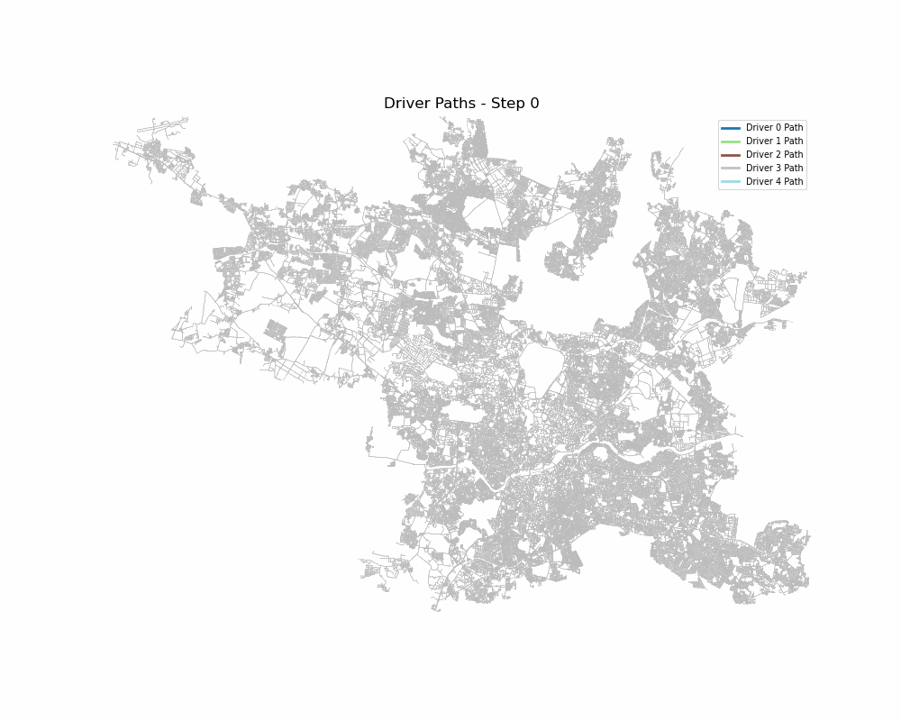

Fleet Simulation with Insight Model
Overview
This project implements a fleet simulation system for optimizing driver allocation in a ride-hailing service, using an insight model to guide drivers to high-demand zones. The simulation is built around a city’s road network (default: Hyderabad, India) and leverages geospatial data, demand modeling, and optimization techniques to maximize trip fulfillment, driver revenue, and zone coverage. Key features include:

Geospatial Modeling: Uses H3 indexing and OSMnx for efficient spatial computations and road network routing.
Demand Generation: Simulates realistic passenger demand with hotspot-based origins and destinations.
Insight Generation: Provides drivers with online (immediate) and offline (future demand) insights using Integer Linear Programming (ILP) or Simulated Annealing (SA).
Metrics Tracking: Logs fulfilled trips, unfulfilled demands, driver utilization, revenue, and insight acceptance rates.
Visualization: Generates animations of driver movements (optional, saved as MP4 or GIF).

Repository Structure
fleet-simulation/
├── main.py                 # Entry point for the simulation
├── config.yaml            # Configuration file for simulation parameters
├── models/
│   ├── demand.py          # Demand unit and model for passenger demand
│   ├── driver.py          # Driver model for movement and decision-making
│   ├── insight.py         # Insight model for generating driver recommendations
│   └── trip.py            # Trip model for assigning and managing trips
├── simulation/
│   ├── engine.py          # Core simulation engine
│   └── scheduler.py       # Scheduler for step-by-step simulation execution
├── utils/
│   ├── data_generation.py # Utilities for loading graphs and initializing data
│   ├── optimization_manager.py # Optimization logic for driver-zone assignments
│   └── visualization.py   # Visualization tools for animating driver movements
└── README.md              # This file

Prerequisites

Python: 3.8 or higher
Dependencies:
osmnx: For road network generation and geospatial operations
h3-py: For H3 geospatial indexing
networkx: For graph-based routing
pulp: For ILP optimization
numpy: For numerical computations
matplotlib: For visualization
pyproj: For coordinate transformations
shapely: For geometric operations
scipy: For spatial indexing (KDTree)
ffmpeg (optional): For saving MP4 animations
pillow (optional): For saving GIF animations

Install dependencies using:
pip install osmnx h3-py networkx pulp numpy matplotlib pyproj shapely scipy

For animations, ensure ffmpeg is installed (for MP4) or pillow (for GIF):

On Ubuntu: sudo apt-get install ffmpeg
On macOS: brew install ffmpeg

Setup

Clone the repository:git clone <repository-url>
cd fleet-simulation

Ensure all dependencies are installed (see Prerequisites).
Configure config.yaml to adjust simulation parameters (see Configuration section).

Configuration
The config.yaml file defines simulation parameters. Key settings include:

city: City name (e.g., "Hyderabad, India").
hotspots: Number of hotspot nodes (default: 2000).
h3_resolution: H3 resolution for geospatial indexing (7–10, default: 7).
num_drivers: Number of drivers (default: 5).
steps_per_epoch: Steps per epoch (default: 150, ~2.5 hours).
epochs: Number of simulation epochs (default: 2).
insight_interval: Steps between insight updates (default: 15).
demand_rate_per_step: New demands per step (default: 5000).
max_trip_distance: Maximum trip distance in meters (default: 5000).
num_demands: Total demands to generate (default: 5000).
optimization: Parameters for ILP/SA (e.g., lambda, alpha, M_min).
visualization: Animation settings (animate, save, filename, interval).

Example config.yaml:
city: "Hyderabad, India"
hotspots: 2000
h3_resolution: 7
num_drivers: 5
steps_per_epoch: 150
epochs: 2
insight_interval: 15
demand_rate_per_step: 5000
max_trip_distance: 5000
num_demands: 5000
optimization:
  lambda: 1
  alpha: 0.0001
  M_min: 8
visualization:
  animate: false
  save: true
  filename: "driver_animation.gif"
  interval: 300

Usage
Run the simulation with:
python main.py

Output

Console Logs: Detailed logs of driver positions, trip assignments, and metrics.
Metrics Summary: At the end of the simulation, outputs averages for:
Fulfilled trips
Unfulfilled demands
Total revenue
Driver utilization
Average driver idle time
Average driver trips
Insight acceptance rate

Visualization (if enabled):
Saves an animation to driver_animation.gif (or specified filename).
Optionally displays the animation if animate: true in config.yaml.

Example Output
🌐 Loading city graph and initializing data...
📦 Generated 5000 active demand units
🚀 Running Epoch 1/2
...
📊 Final Simulation Summary:
fulfilled_trips: 1234.50
unfulfilled_demands: 567.50
total_revenue: 98765.43
driver_utilization: 0.85
average_driver_idle_time: 45.20
average_driver_trips: 246.80
insight_acceptance_rate: 0.78

Features

Geospatial Efficiency: Uses H3 for spatial partitioning and OSMnx for road network routing.
Dynamic Optimization: Balances offline (future demand) and online (current surge) objectives using ILP or SA.
Demand Modeling: Simulates realistic demand with hotspot-based origins and reusable patterns.
Visualization: Animates driver paths with unique colors for each driver.
Robust Error Handling: Validates coordinates, H3 cells, and optimization inputs.

Limitations

Static road network; no real-time traffic data.
Fixed H3 resolution per simulation.
ILP may be slow for large fleets; use SA for faster results.
Simplified driver behavior (fixed insight propensity).
Visualization assumes valid UTM coordinates within a specific range.

Future Improvements

Add real-time traffic integration.
Support dynamic H3 resolution adjustments.
Enhance visualization with demand heatmaps.
Implement learning-based driver behavior models.
Parallelize trip assignments for scalability.

Contributing
Contributions are welcome! Please:

Fork the repository.
Create a feature branch (git checkout -b feature-name).
Commit changes (git commit -m "Add feature").
Push to the branch (git push origin feature-name).
Open a pull request.

**Driver Animation Example:**  

The above animation shows driver movements across the city during the simulation. Each color represents a different driver.
In the curerent setting drivers are moving 20 cells per step. (configured in driver's step_along path)

License
This project is licensed under the MIT License. See the LICENSE file for details.
Contact
For questions or issues, please open an issue on the repository or contact the maintainers.
